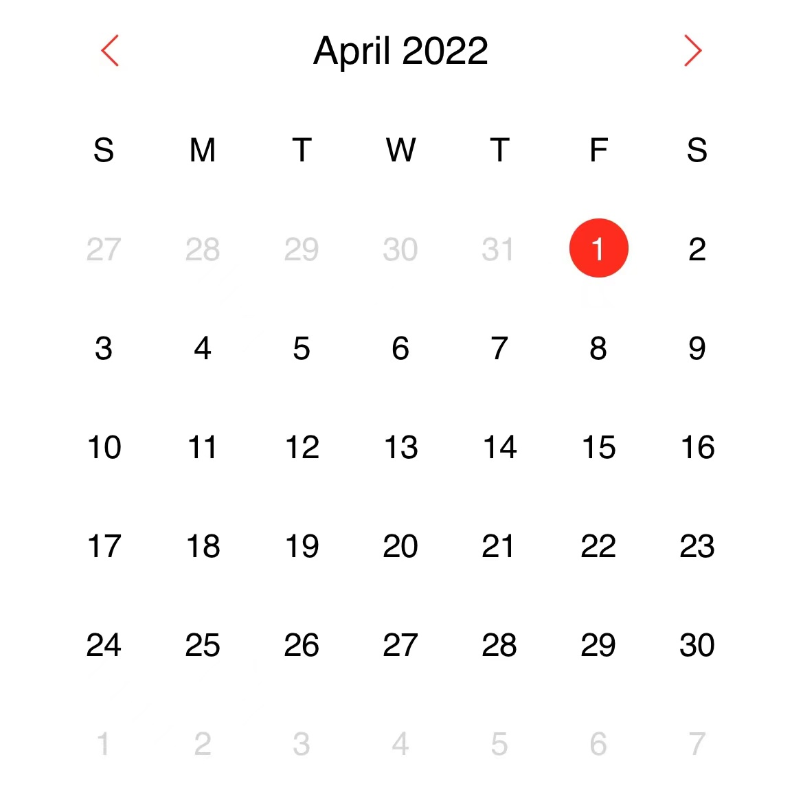

# Tyer

A Datepicker with multi-modes of date ,range and calendar

> No IE support


<br/>

## Install

```bash
     yarn add tyer
    //or
     npm install tyer
```

## Use

[See demo here](./index.html)

[See source code here](./tyer.js)

```js


import Tyer from "tyer";
//  Date mode (default)
    function onDateValueChange(values /* Array<Date> */) {
        console.log(values);
    }
    const locale = navigator.language
    const dayIntl = new Intl.DateTimeFormat(locale, { weekday: "narrow" });
	const dateIntl = new Intl.DateTimeFormat(locale, {
		dateStyle: "medium",
	});
	const monthIntl = new Intl.DateTimeFormat(locale, {
		month: "long",
		year: mode == 'calendar' ? void 0 : "numeric",
	});
	const yearIntl = new Intl.DateTimeFormat(locale, { year: "numeric" });
	const defaultIntl= {
		day: (date) => dayIntl.format(date),
		date: (date) => dateIntl.format(date),
		month: (date) => monthIntl.format(date),
		year: (date) => yearIntl.format(date),
	};


const tyer=  new Tyer({
	el: document.getElementById("date"),
	mode: "date" // date | range | calendar,
	onChange: onDateValueChange,
    locale: 'zh-CN' // navigator.language,
    intl:defaultIntl()
});


// Range mode only
tyer.setRange(new Date(), new Date(2022,3,20))

tyer.setDate(new Date(2022, 3, 14))
// display full dates list of April
tyer.setValue(new Date(2022,3,15))
// highlight Apri 15 2022 on ui

const values=tyer.getValue ()
//  returns Array<Date>

```

## Theming

```css
:root {
	--tyer-active-color: $your-color;
	--tyer-active-text-color: $your-color;
	--tyer-action-color: $your-color;
	--tyer-action-hover-color: $your-color;
}
```

## API

> setDate (date:Date):void

set date to `Tyer` instance and render its dates list

> setRange(date1:Date, date2:Date):void

(range mode) set two date object to `Typer` instance and render on ui

> setValue(date1:Date,date2:Date,...dateN:Date ):void

set values to `Typer` instance and render on ui

> getValue():Date[]

get all values of `Tyer` instance
